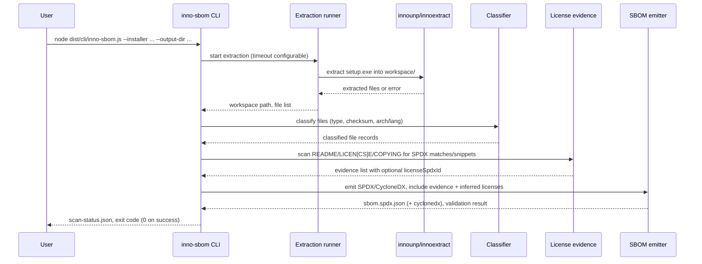

# Inno Setup installer → SBOM workflow

This document explains how the `inno-sbom` CLI turns a single Inno Setup installer (e.g., `setup.exe`) into an SPDX/CycloneDX SBOM, what it depends on, and the data required along the way.

## Prerequisites
- Node.js 18+; project built (`npm run build`).
- Extractors available: place `innounp.exe` and `innoextract.exe` in `./bin` (preferred) or on `PATH`.
- An installer to analyze (fixture: `tests/fixtures/inno/iq2-setup.exe`).
- Enough disk for the extracted workspace under `<output-dir>/workspace`.

## End-to-end steps
1. **Extraction**
   - `inno-sbom` picks `innounp` (fallback to `innoextract`) and extracts the installer into `<output-dir>/workspace`.
   - Timeout is configurable via `--timeout-seconds` (default 900s). Extraction failures map to exit code 3 (or 6 on timeout).
2. **Classification**
   - Each extracted file is normalized to an install path, SHA256 hashed, and typed (executable/dll/script/config/documentation/resource/other).
   - Architecture/lang hints are derived from filenames/paths; metadata placeholders recorded for future PE parsing.
3. **License evidence collection**
   - Reads small README/LICEN[CS]E/COPYING files (<256KB) and looks for common SPDX license texts (Apache-2.0, MIT, BSD-2/3, GPL/LGPL, MPL-2.0, EPL-2.0, Unlicense, CC0, CC-BY-4.0, ISC).
   - Evidence captures a snippet (up to ~2KB) and optional `licenseSpdxId` when a match is found.
4. **License inference (per file)**
   - Direct evidence linked to the file wins; if none, the nearest license evidence in the same directory tree is used.
   - Priority: evidence `licenseSpdxId` → filename/text regex hints (MIT/Apache/BSD/…) → `LicenseRef-<license-file>` → `LicenseRef-Readme` → `NOASSERTION`.
5. **SBOM emission**
   - Emits SPDX JSON (`sbom.spdx.json`) and/or CycloneDX into `<output-dir>`.
   - `hasExtractedLicensingInfos` contains evidence snippets and IDs; files reference evidence IDs.
   - Writes `scan-status.json` with coverage, errors, exit code mapping, and paths to artifacts.
6. **Workspace handling**
   - If `--retain-workspace` is set, extracted files stay under `<output-dir>/workspace` for reuse/debugging; otherwise they may be cleaned up in future runs.

## How to run
```bash
node dist/cli/inno-sbom.js \
  --installer ./tests/fixtures/inno/iq2-setup.exe \
  --output-dir ./out/inno-iq2 \
  --formats spdx,cyclonedx \
  --timeout-seconds 900 \
  --retain-workspace
```
Outputs: `sbom.spdx.json`, optional CycloneDX, `scan-status.json`, and (if retained) `workspace/`.

## Sequence

